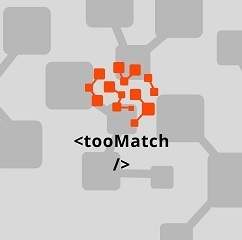
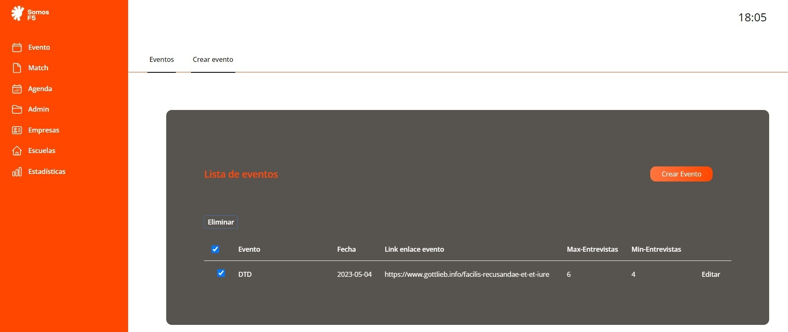
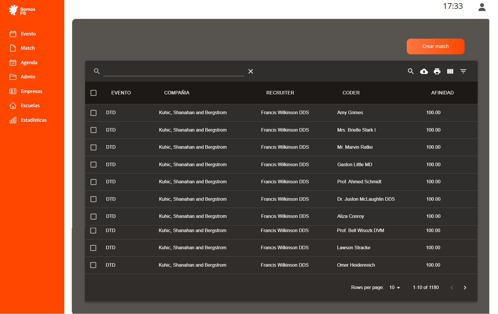
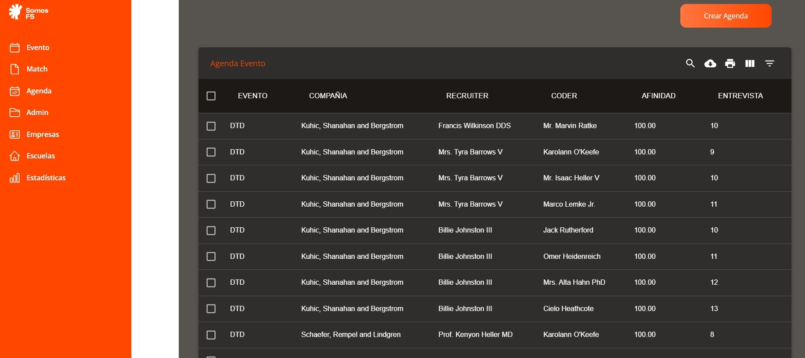
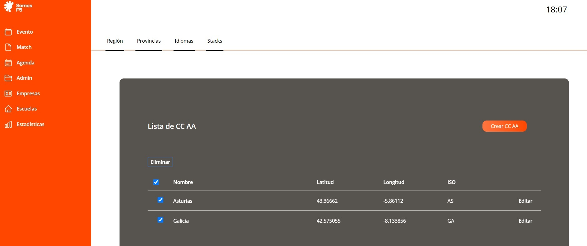
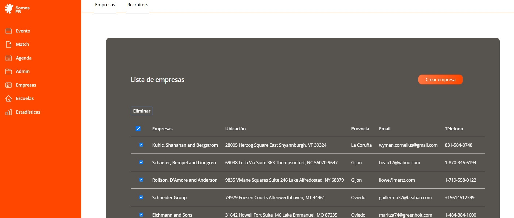
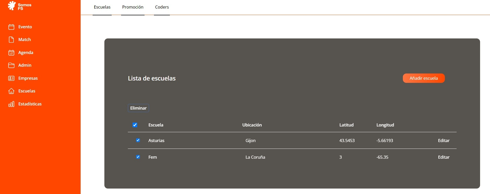
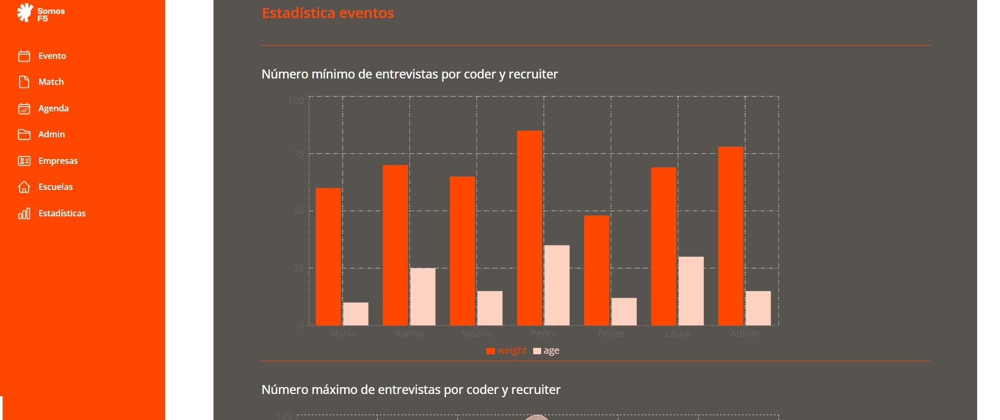

<h1 align="center"> PREMATCH-DTD</h1> 

Este repositorio almacena la aplicación Prematch-DTD en Front-end que complementa el servicio API-PM-DTD creado en Laravel (***https://github.com/MarielaYamilex70/api-pm-dtd.git***).

## Descripción del proyecto :speaking_head:
Este proyecto es en herramienta que permite hacer Pre-Match entre un coder y un recruiter a través de especificaciones afines.

## Estado :page_facing_up:

## Vistas :desktop_computer:
### Este es el logo de TooMatch

### Estas son las vistas de la página:

## Tecnologías :hammer_and_wrench:
* **React** - utilizado para diseñar los componentes y las vistas del proyecto
* **HTML** - utilizado para crear la estructura básica de la página web
* **CSS** - utilizado para estilizar la interfaz de usuario
* **Tailwind** - utilizado para estilizar la interfaz de usuario
* **JavaScript** - utilizado para el desarrollo de página web
* **Material UI** - utilizado para estilizar la interfaz de usuario
* **npm** - utilizado para manejar las dependencias

## Instalación :computer:
* Abre una terminal en tu ordenador
* Después, clona el repositorio utilizando ***$ git clone https://github.com/IrisGomis/prematch-dtd.git***
* En tu terminal utiliza ***$ npm install***
* Para verlo, utiliza en tu terminal ***$ npm start***

## Colaboradoras :family_woman_woman_girl_girl:
Este proyecto ha sido realizado por un equipo de 5 programadoras en formación:

| [ Mariela Yamilex ](https://github.com/MarielaYamilex70) |  [ Iris Gomis ](https://github.com/IrisGomis) |  [ Natalia Iriarte](https://github.com/Natalia-irlo) | [ Diana Borrajo](https://github.com/Dianab177) | [ Irene Fernández](https://github.com/irenefl) |
| :---: | :---: | :---: | :---: | :---: |

## Licencia :closed_lock_with_key:
© [Prematch DTD]()
